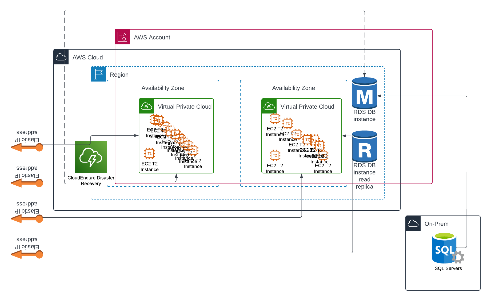
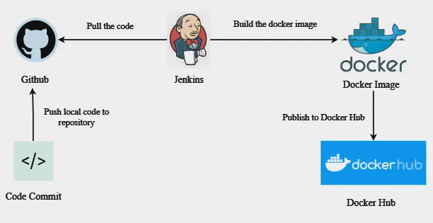

# AWS-final-project
AWS Final Project - Technion DevOps

The provided script (set_env.sh) is an AWS infrastructure setup script written in Bash. 
It performs the following tasks using the AWS CLI:

- Creates a VPC: A Virtual Private Cloud (VPC) is created with the CIDR block 10.0.0.0/16. It also tags the VPC with a name MyVPCSetup.
- Creates a Subnet: A subnet is created within the VPC with the CIDR block 10.0.1.0/24. The subnet is tagged with a name Subnet-MyVPCSetup.
- Creates an Internet Gateway (IGW): An internet gateway is created and will be attached to the VPC for internet access.
- Attaches the IGW to the VPC: The script attaches the created internet gateway to the VPC, enabling internet connectivity.
- Creates a Route Table: A route table is created, a default route (0.0.0.0/0) is added to route traffic via the internet gateway, and the subnet is associated with this route table.
- Creates a Security Group: A security group is created and configured to allow inbound traffic on ports 22 (SSH), 80 (HTTP), and 443 (HTTPS).
- Generates a Key Pair: An SSH key pair (my-keypair) is created and saved as a .pem file to access EC2 instances later.
- Launches an EC2 Instance: An EC2 instance is launched in the subnet with:
  - specified AMI (ami-0e2c8caa4b6378d8c)
  - instance type (t2.micro)
  - security group
  - key pair

- Outputs Resource Details: After the resources are created, the script outputs the IDs of the VPC, subnet, internet gateway, route table, security group, and EC2 instance.
- The SSH private key generated for EC2 access has permissions set to 400 to ensure secure access.

- After the EC2 instances are launched, ssh access the instance tagged as 'JenkinsEC2' and git clone the project repository, then run jenkins bash to create docker, pull image
and launch container for jenkins. 
Open a web browser on your local machine to enter the jenkins console with the ec2 public ip and port 80.  
Run jenkinsfile for execution of Note-App CI/CD.

- Then, ssh access the second instance 'nginxEC2' and run script to launch Nginx and deploy note-app application.
Open a additional web browser on your local machine to enter the application (using Nginx) with the ec2 public ip and port 80. 

## Steps 

- install and update local debian environment
- install and update aws cli on local debian vm
- aws configure and connect your local vm to aws account
- run bash script to create environment in aws (two ec2 instances: JenkinsEC2 & NginxEC2)
- check environment created in aws
- connect by ssh from local vm to aws ec2 instances created
- install and configure nginx on instance nginx 
- install and configure jenkins on jenkins instance

## Installation 

### Install and configure AWS cli 

- sudo apt update
- sudo apt install awscli
- aws --version
- aws configure
- add session token (if using a temporary session crediatials) to ~/.aws/credentials (''' vim ~/.aws/credentials ''')
- sudo apt update && sudo apt upgrade awscli
- cat ~/.aws/credentials
- aws sts get-caller-identity (this will confirm that you're connected to your aws account)
- git clone repository from github 
- run bash script aws_env_set.sh
- enter JenkinsEC2 instance by ssh
- git clone repository from github
- run bash script jenkins_docker.sh
- open web browser to access jenkins console (use token retrieved from InitialAdminPassword)
- run jenkinsfile for CI/CD (update dockerhub credentials)
- enter NginxEC2 instance by ssh
- run bash script nginx_deploy.sh
- open web browser to access note-app (using Nginx)

### Create an aws environment 

- ''' VPC_CIDR="10.0.0.0/16"
      SUBNET_CIDR="10.0.1.0/24"
      REGION="us-east-1"
      TAG_KEY="Name"
      TAG_VALUE="MyProjectVPC"
      SECURITY_GROUP_NAME="my-project-security-group"
      SECURITY_GROUP_DESC="Project security group for my VPC" '''

- ''' VPC_ID=$(aws ec2 create-vpc --cidr-block "$VPC_CIDR" --region "$REGION" --query 'Vpc.VpcId' --output text) '''
- ''' echo "VPC created with ID: $VPC_ID" '''
- ''' aws ec2 create-tags --resources "$VPC_ID" --tags Key="$TAG_KEY",Value="$TAG_VALUE" --region "$REGION" '''
- ''' echo "VPC tagged with $TAG_KEY=$TAG_VALUE" '''
- ''' SUBNET_ID=$(aws ec2 create-subnet --vpc-id "$VPC_ID" --cidr-block "$SUBNET_CIDR" --region "$REGION" --query 'Subnet.SubnetId' --output text) '''
- ''' echo "Subnet created with ID: $SUBNET_ID" '''
- ''' aws ec2 create-tags --resources "$SUBNET_ID" --tags Key="$TAG_KEY",Value="Subnet-$TAG_VALUE" --region "$REGION" '''
- ''' echo "Subnet tagged with $TAG_KEY=Subnet-$TAG_VALUE" '''
- ''' IGW_ID=$(aws ec2 create-internet-gateway --region "$REGION" --query 'InternetGateway.InternetGatewayId' --output text) '''
- ''' echo "Internet Gateway created successfully in region "$REGION" with ID: "$IGW_ID" " '''
- ''' aws ec2 attach-internet-gateway --internet-gateway-id "$IGW_ID" --vpc-id "$VPC_ID" --region "$REGION" '''
- ''' echo "Internet Gateway $IGW_ID successfully attached to VPC "$VPC_ID" in region "$REGION"." '''
- ''' ROUTE_TABLE_ID=$(aws ec2 create-route-table --vpc-id "$VPC_ID" --region "$REGION" --query 'RouteTable.RouteTableId' --output text) '''
- ''' echo "Route Table created with ID: "$ROUTE_TABLE_ID"" '''
- ''' aws ec2 create-route --route-table-id "$ROUTE_TABLE_ID" --destination-cidr-block 0.0.0.0/0 --gateway-id "$IGW_ID" --region "$REGION" '''
- ''' echo "Route successfully added to Route Table "$ROUTE_TABLE_ID" " '''
- ''' aws ec2 associate-route-table --route-table-id "$ROUTE_TABLE_ID" --subnet-id "$SUBNET_ID" --region "$REGION" '''
- ''' echo "Subnet "$SUBNET_ID" successfully associated with Route Table "$ROUTE_TABLE_ID" " '''
- ''' SECURITY_GROUP_ID=$(aws ec2 create-security-group --group-name "$SECURITY_GROUP_NAME" --description "$SECURITY_GROUP_DESC" --vpc-id "$VPC_ID" --region "$REGION" --query 'GroupId' --output text) '''
- ''' echo "Security Group created successfully with ID: "$SECURITY_GROUP_ID" " '''
- ''' aws ec2 authorize-security-group-ingress --group-id "$SECURITY_GROUP_ID" --protocol tcp --port 22 --cidr 0.0.0.0/0 --region "$REGION" '''
- ''' aws ec2 authorize-security-group-ingress --group-id "$SECURITY_GROUP_ID" --protocol tcp --port 80 --cidr 0.0.0.0/0 --region "$REGION" '''
- ''' aws ec2 authorize-security-group-ingress --group-id "$SECURITY_GROUP_ID" --protocol tcp --port 443 --cidr 0.0.0.0/0 --region "$REGION" '''

- ''' echo "VPC ID: "$VPC_ID" "
      echo "Subnet ID: "$SUBNET_ID" "
      echo "Internet Gateway ID: "$IGW_ID" "
      echo "Route Table ID: "$ROUTE_TABLE_ID" "
      echo "Security Group ID: "$SECURITY_GROUP_ID" " '''
  
### Create AWS Key Pair 

- ''' KEY_NAME="my-project-keypair"
      KEY_FILE="${KEY_NAME}.pem" '''
  
- ''' aws ec2 create-key-pair --key-name "$KEY_NAME" --query 'KeyMaterial' --output text > "$KEY_FILE" '''
- ''' echo "Key pair "$KEY_NAME" created successfully and saved as "$KEY_FILE" " '''
- ''' chmod 400 "$KEY_FILE" '''

### AWS EC2 Instances Launch 

- ''' AMI_ID="ami-0e2c8caa4b6378d8c"
      INSTANCE_TYPE="t2.micro" 
      TAG_KEY_EC2="Name"
      TAG_VALUE_EC2="MyProjectEC2Instance" '''

- ''' INSTANCE_ID=$(aws ec2 run-instances --image-id "$AMI_ID" --count 1 --instance-type "$INSTANCE_TYPE" --key-name "$KEY_NAME" --subnet-id "$SUBNET_ID" --security-group-ids "$SECURITY_GROUP_ID" --associate-public-ip-address --tag-specifications "ResourceType=instance,Tags=[{Key="$TAG_KEY",Value="$TAG_VALUE"}]" --query 'Instances[0].InstanceId' --output text) '''
- ''' echo "EC2 instance launched successfully with ID: "$INSTANCE_ID" " '''
- ''' INSTANCE_DETAILS=$(aws ec2 describe-instances --instance-ids "$INSTANCE_ID" --query 'Reservations[0].Instances[0].[InstanceId,State.Name,PublicIpAddress]' --output table) '''
- ''' echo "$INSTANCE_DETAILS" '''

### Check Instances Running and Conncet by SSH

- ''' aws ec2 describe-instances --filters Name=instance-state-name,Values=running --query 'Reservations[].Instances[].{InstanceId: InstanceId, PublicIpAddress: PublicIpAddress, PrivateIpAddress: PrivateIpAddress, State: State.Name, InstanceType: InstanceType}' --output table '''
- ssh -i "my-project-keypair.pem" ubuntu@[EC2-publicIP] ''' (change EC2-publicIP with public IP allocated to the launched instace)

### Install Jenkins on Jenkins Master EC2 Instance

- ''' sudo apt-get update -y '''
- ''' sudo apt-get install -y ca-certificates curl '''
- ''' sudo install -m 0755 -d /etc/apt/keyrings '''
- ''' sudo curl -fsSL https://download.docker.com/linux/ubuntu/gpg -o /etc/apt/keyrings/docker.asc ''' 
- ''' sudo chmod a+r /etc/apt/keyrings/docker.asc '''
- ''' echo "deb [arch=$(dpkg --print-architecture) signed-by=/etc/apt/keyrings/docker.asc] https://download.docker.com/linux/ubuntu $(. /etc/os-release && echo "$VERSION_CODENAME") stable" | sudo tee /etc/apt/sources.list.d/docker.list > /dev/null
- ''' sudo apt-get update '''
- ''' sudo apt-get install -y docker-ce docker-ce-cli containerd.io docker-buildx-plugin docker-compose-plugin '''
- ''' sudo docker pull jenkins/jenkins '''
- ''' sudo docker run -itd -p 80:8080 --name jenkins_container jenkins/jenkins '''
- ''' sudo docker images '''
- ''' sudo docker exec -it jenkins_container /bin/bash '''
- ''' cat /var/jenkins_home/secrets/initialAdminPassword '''
- Access Jenkins at http://ec2publicIP:80"

from there can create jenkins pipeline to run on additional ec2 instance that will perform as worker 
the pipeline from the master will run jenkinsfile installed by master in worker and from there will preform a task on app 
in github (or anykind of different ci/cd task)
try to create a main fronthand to run the other scripts (like shown by avishai and ori in the class presentation)

in need to create a sencond ec2 instance from the script, check how to create 2 instances at the same time 
check how to connect the second instance (jenkins worker) to communicate with the first instance (jenkins master) 
i think it's better to change the name of the first instance to jenkins master 

the architecture is to create two ec2 machines which on one ec2 machine will be installed nginx as a webserver that recieves ingress from another ec2 machine that runs jenkins for ci/cd with docker installed, 
that way the ec2 instace will serve as jenkins master and te docker containers in it will be the workers. 
the two ec2 instances will communicate with each other, jenkins thru its workers will send missions to the nginx webserver 

